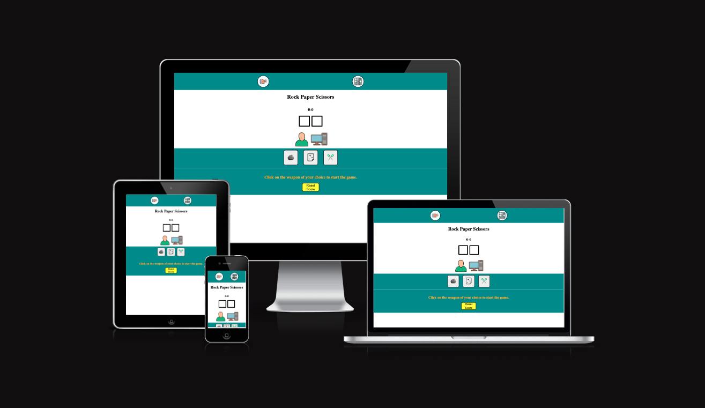
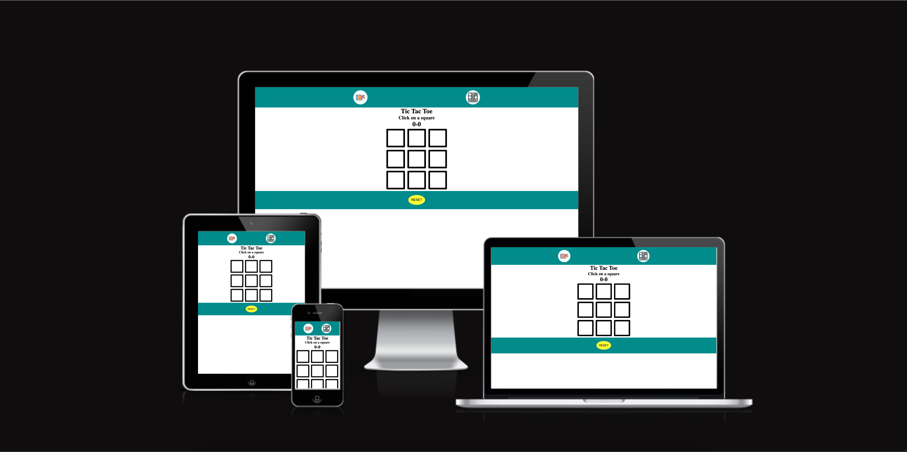
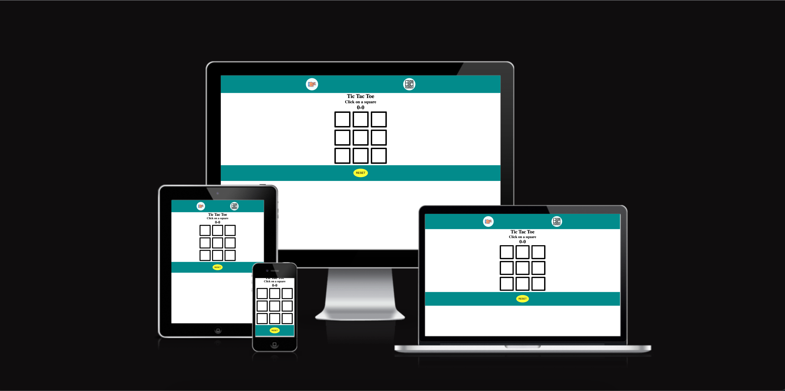
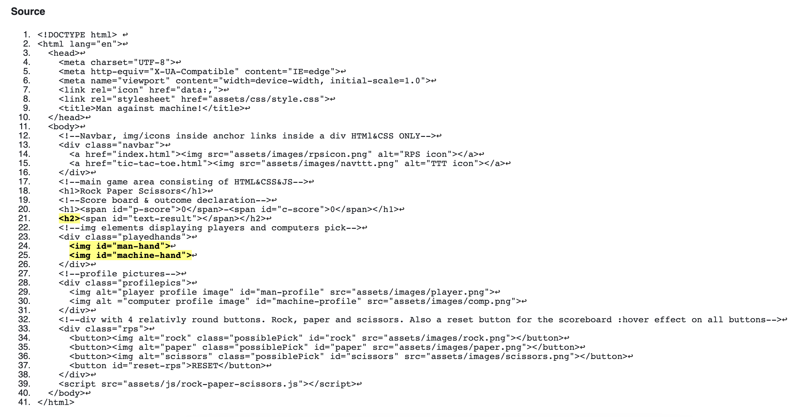
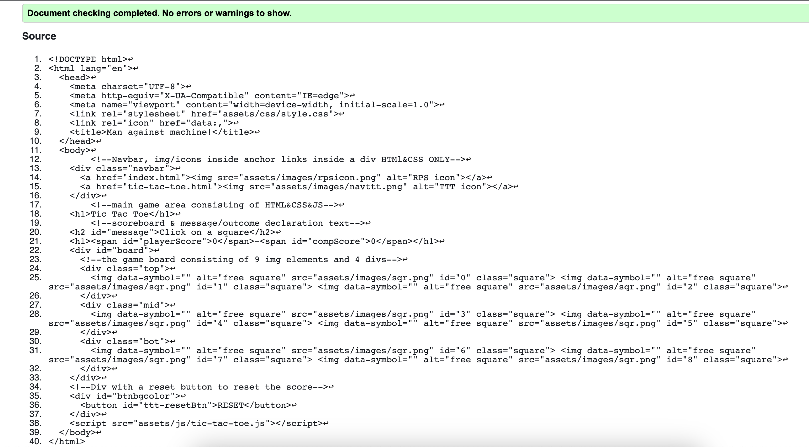
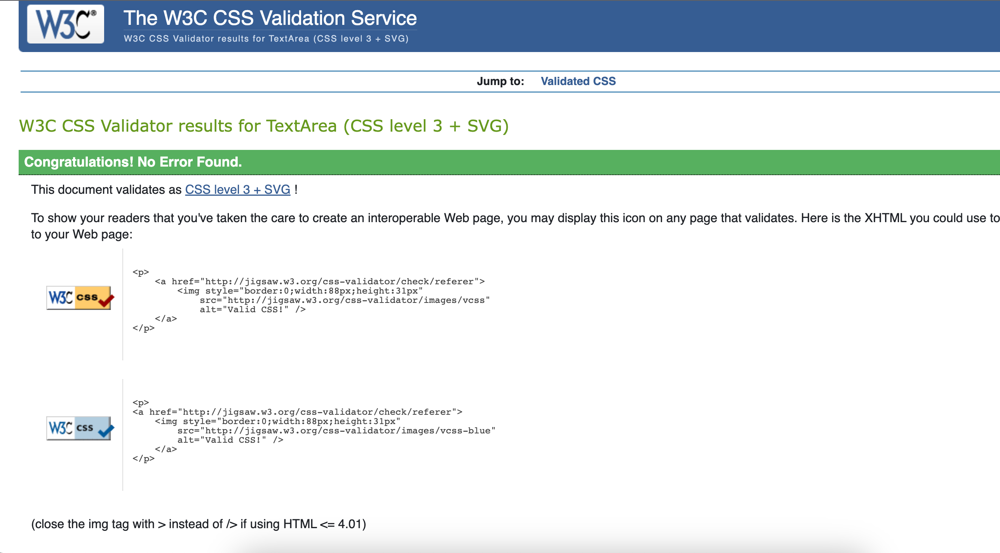
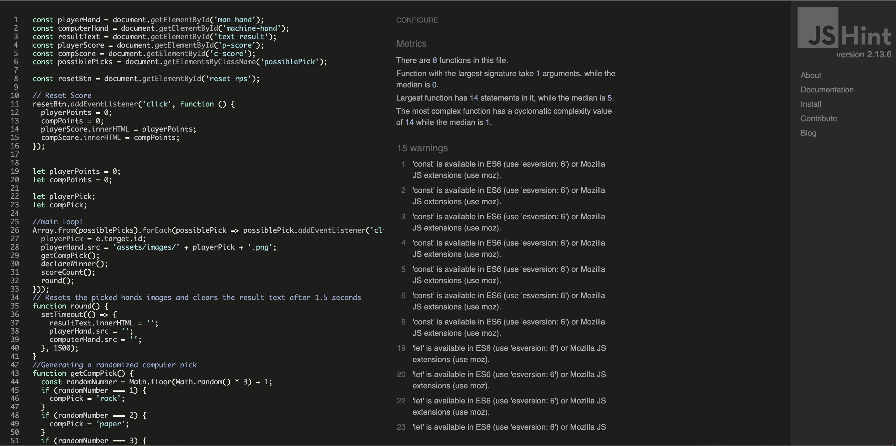
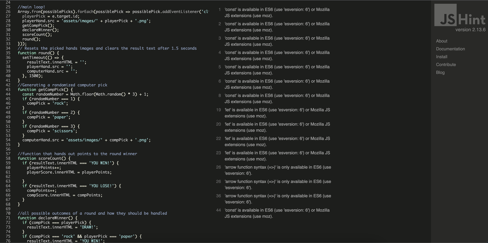
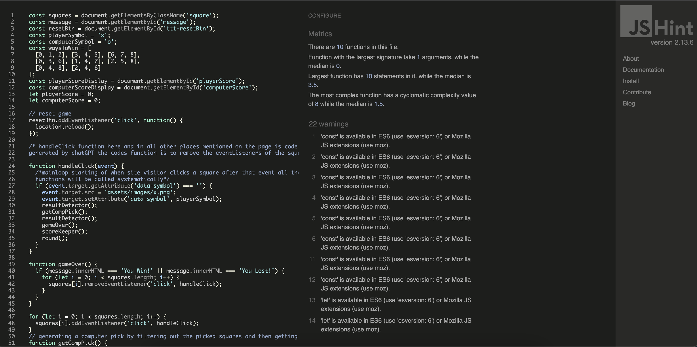
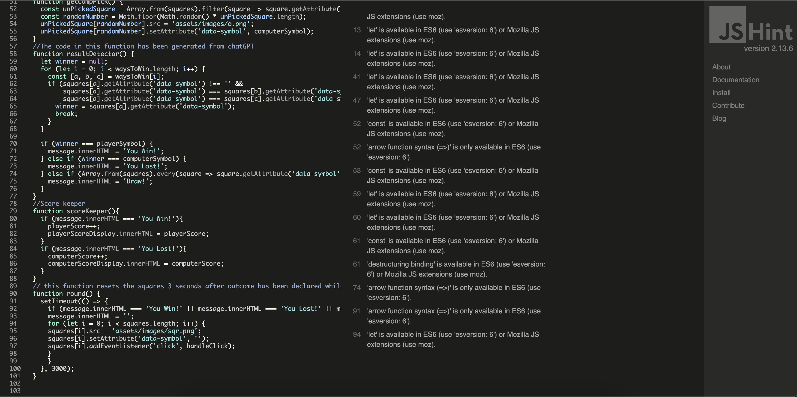

[Link to the live project](https://mejkej.github.io/P2MANvsMACHINE/index.html)
# ManvsMachine.
Play rock paper scissors & Tic tac toe against the computer.
## Introduction:
This was my second project using HTML & CSS and the first one using Javascript. 
So the project contains two games a rock paper scissors game & A Tic tac toe game on the second page.
HTML and CSS for structure and styling and Javascript for functionality.

## Purpose:
Purpose, well the primary goal or purpose of this project was for me to learn Javascript.
And i did succesfully create two games that would probably have been considered less than mediocre in 1985 hehe.
But Rome was not built in a day and neither is a great programmer! 
## The Rock paper scissors game HTML & CSS part:
### Navbar
The navbar located at the top of the page is a Div element with a height of 100px and a 100% width with a
background color of darkcyan.
In the Div there are two anchor elements each with a image element nested inside them one icon displaying a handscissor
and the other one a Tic tac toe board. The images are rounded and with a white background color, there is also a css
hover effect turning the white background color slightly darker/gray when hovered. First time i used css flex and it 
was very practical.

### The game area
H1 element with the text "Rock Paper Scissors" on the top followed by the scoreboard consisting of a H1 element
containing two span elements one for the players score one for the computers score. Underneath the scoreboard there
is a H2 element with a span nested inside it, they are responsible for declaring the outcome of the game.

Next up a Div containing two image elements with an id of man-hand & machine-hand. These images will display both
players pick. Below these images are the players profile pictures. 

And on the bottom there is a Div with the same darkcyan color, a height of 90px and a 100% width.
Inside the div there are 4 round buttons 3 of witch has images nested inside them (Rock, paper, and scissors) The forth button is yellow with the text reset (to reset the score) All buttons has a hover effect but with a darkred color instead.
## The Rock, paper, scissors Javascript:
First off i declared all the global scope variables and linked them to their HTML elements.

### Reset score button
I added a event listener to the reset button if clicked the let variables 
'playerPoints' & 'compPoints' will be set to 0.
and the Const playerScore & const compScore.innerHTML displayes the let variables value.

### The main loop

starts of with an Array from the const variable PossiblePicks. Array containing rock, paper & scisssors ofc.
using a forEach loop and an arrow function possiblePicks turns in to possiblePick that has an eventlistener listening 
for a click. the let variable playerPick gets assigned the e.targets.(ID) the id could be rock paper or scissors.
playerHand.src gets assigned 'assets/images/' + playerPick + '.png'. (The path to the clicked image)
the loop then continues with:
  getCompPick();
  declareWinner();
  scoreCount();
  round();

  ### GetCompPick
  inside this function a const variable is declared called randomNumber. randomNumber = a method 
  "Math.floor(Math.random() * 3) + 1;
  Math.floor Makes the random number generated to a 0 - 1 or 2 and not 0,33 0,66 or 0,99.
  The +1 makes the possible numbers generated 1, 2, or 3 instead of 0, 1, or 2.
  Then there is 3 if statements pairing the random numbers to either rock paper or scissors.
  If randomNumber === 1 compPick = rock and computerHand.src = 'assets/images/' + CompPick + '.png'.

  ### declareWinner
  In this function all the possible outcomes of a round is stated and how they should be handled.
  So the picks gets compared and then the resultText.innerHtml Declares Win Loss or Draw.

  ### scoreCount
  This function handles the scoreboard by looking at the resultText.innerHtml messsage.
  If the result text declares 'YOU WIN!' the let variable playerPoints increases by 1.
  And that then results in that the const variable playerScore.innerHTML displays the value of
  playerPoints and viceversa if the computer wins.
 
  ### round
  This function resets the SRC of the playerHand image & compHand image. It also clears the resultText.
  So that after both players have made their Picks the result has been declared and the scoreboard has been
  updated. Both played hand images and result text is cleared indicating that its time to play the next round
  while still keeping track of the Scoreboard.

  ## The Tic Tac Toe games HTML & CSS:

  ### The Navbar 
  Its exacly the same as on the other page.

  ### The Game area
  H1 Element with the text "Tic Tac Toe". Below the header there is a H2 element with with the text "Click on a square".
  Below that one there is a H1 element with two spans nested inside of it, this is the Scoreboard.
  
  Then comes the Gameboard consisting of 4 divs and 9 image elements. So there are three divs wrapping 3 inline image elements each. The forth div wraps around them all. The squares are 100px wide and high unless you are using a screen smaller than 310pxs wide. Then they will be 70x70 px.

  Below there is a div with the same color as the navbar but this div does only contain one button. Button alignment is centered and the shape is oval. Color is yellow with the black text, 'RESET'. Just like the buttons in the other game there is a hover effect. I Tryed to keep the styling consistant on both pages. 

## The Tic tac toe games Javascript:
### Cached the dom
First of i declared most of the variable at the top. Some of them i linked to the HTML and others was assigned a value.

### ResetButton
Added a event listener to the button if button is clicked the page will get reloaded.
Im sure there are better ways of doing that but time was of the essence and it does the job.

### for loop 
squares is a const varible declared on the top of the page the document can be gotten using a class selector.
The for loop adds a click event listener to the squares[i]. Then it refers to the handleClick function,
resulting in that everytime a square is clicked the handleClick function is called to handle the event.

### handleClick(event)
The function first checks if clicked square has a data-symbol if not that means the square
has not yet been picked and the square/event target gets asigned a data-symbol attribute of 'x' / playerSymbol.
Then the the event target get assigned the src of 'assets/images/x.png'. The function then checks for a winner or a loser
to be declared by the #message H2. If that happens the squares event listener will be removed.

### getCompPick 
squares is a const variable declared on the top of the page with a path to the html using a class selector.
Inside this function a const variable named unPickedSquare is declared and then gets assigned an array from squares.
The Array filters out the squares that has been asigned a data-symbol. Another const variable named randomNumber is declared and get asigned the Math.floor(Math.random) method returning a randomPick from the unPickedsquares.
the returned unPickedSquare gets assigned the src 'assets/images/o.png' and then the data-symbol attribute cumputerSymbol/'o'.
### resultDetector 
The result detector will run its check after every move both after player and then after the computer.

First of all the img elements/squares has all been asigned an id first one is #0 and last one is #8.
There is a const variable at the top of the page named waysToWin. It has been assigned eight arrays,
These arrays contains the possible ways to win, three numbers the squares ids.

Inside the function a let variable named winner is declared and given the value of null. 
Then there is a for loop looping the ways to win variables length.
Inside the function there is a new const variable declared given an array [a, b, c].
[a, b, c] Is then asigned waysToWin[i] in other words [a] is now the first number in the eight arrays
[b] the second and [c] the third.

Then the function checks if square [a] has been asigned a data-symbol. it then goes on to compare if [a]&[b]
has the same data-symbol. Then it checks if [a]&[c] data-symbol equals each others. If everything so far has
turned out to be true, the let variable winner = square[a] data-symbol. if winner = playerSymbol the #message
will read 'You Win!' and if the winner = computerSymbol the #message.innerHTML will read 'You Lost!'

Lastly incase there was no winner, the function continues to run an array from every square checking if there
is any squares that has not yet been asigned a data-symbol. If all squares has been asigned a data-symbol
that means its a draw and the #message will read 'Draw!'

### gameOver
This function checks for the #message to call a win or a loss. If that happens a for loop will start looping the 
squares[i] and the event listener will be removed from the squares one by one. By the handleClick (event) function. 

### scoreKeeper
On the top of the page i declared two let variables playerScore & computerScore these was asigned the value of 0.
I also declared two const variables player&computerScoreDisplay and i linked them to the html with an id. 
If the #message.innerHTML declares You Win! playerScore++ and playerScoreDisplay.innerHTML = playerScore.
if the #message declares You Lost the same thing happens but to the computerScoreDisplay of course.

### round
If #message declares any outcome it means that the game is over. So when that happens this function
clears the #message then starts a for loop for all the squares[i] asigning them the src 'assets/images/sqr.png'.
Setting their data-symbol to '' and calls the handleClick function to restore the event listeners.
So 3 seconds after completed game the game is reset but the score count is not.

## My personal thaught on the project
The jump from Html & Css to Javascript was surprisingly challenging i gotta say. But for everyday that i worked on the project it made more and more sense. I think i almost finished the rock paper scissors game 10 times just to clear the whole JS file and redo the whole thing over and over again until it made sense. If you know html css and javascript you can get a job, atleast thats what a few dudes on youtube claims. So i did my best to try and learn as much as possible.
But the clock is ticking and i gotta get started on the next project! All in all it was a great experience and project.
I am certainly looking forward to the day that i will be working on something more exciting!

## Resources:
The resources i have used to get this project done

My mentor Seun

Open Ais chat GPT:
https://chat.openai.com/chat
This has been a complety incredible tool that i have used. NOT TO WRITE THE CODE FOR ME.
But more like a teach. All doe i have credited some of the code to Chat GPT.

https://www.youtube.com/ 

https://www.w3schools.com/

https://codeinstitute.net/global/

CSS formated by:
https://www.cleancss.com/css-beautify/

Code formated by:
https://www.freeformatter.com/html-formatter.html#before-output

HTML & CSS validated by:
https://validator.w3.org/#validate_by_input

Javascript validated by:
https://jshint.com/

Chromes developer tools has also been a great resource.

## Sources off icons and images:
https://icons8.com/ has contributed to every single image/icon used on the website.
https://ui.dev/amiresponsive for the Images diplaying the project using different devices.

## Formating, Validating, Testing & Final Photos
The Html Css and Javascript has been validated by the resources mentioned above and there are 
photos of it below.
The validator had a few opinions of my index.html the absence of alt attribute for the playerHand
and computerHand images and some empty h1 or h2 and span elements but they are only empty until the 
Javascript says otherwise.
## Clone the project
Incase anyone want to contribute to the project or develop it further [here are instructions on how to clone it](https://docs.github.com/en/repositories/creating-and-managing-repositories/cloning-a-repository#cloning-a-repository)

