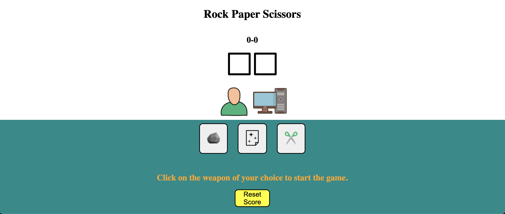
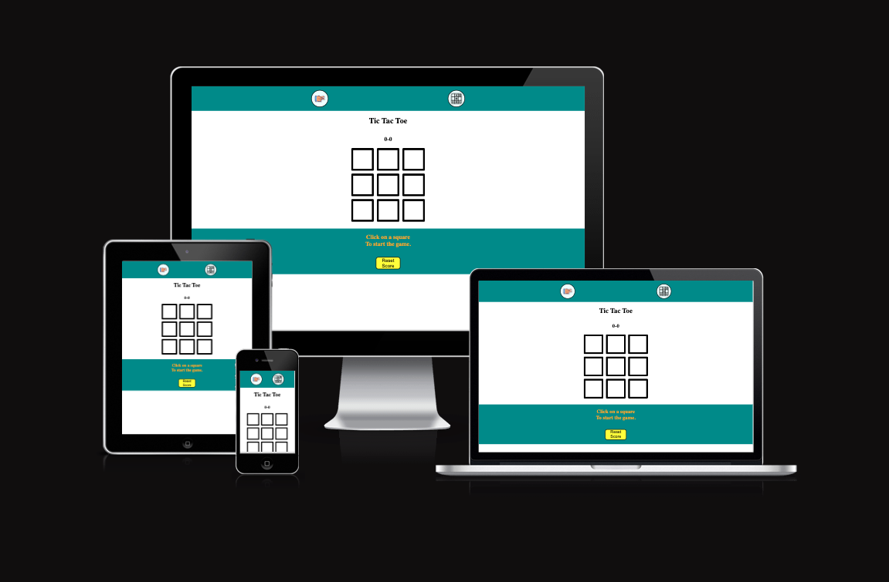
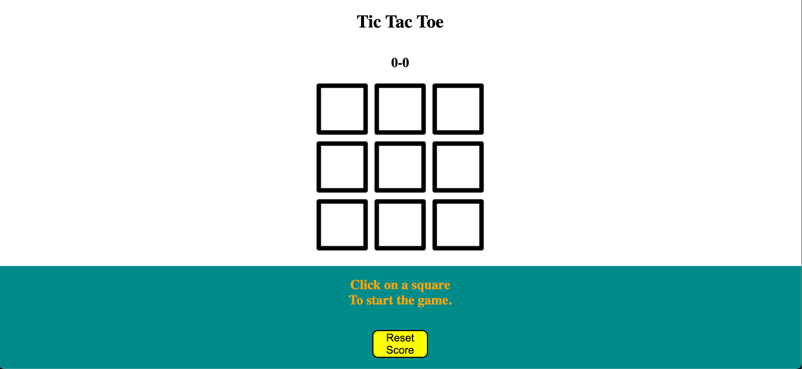
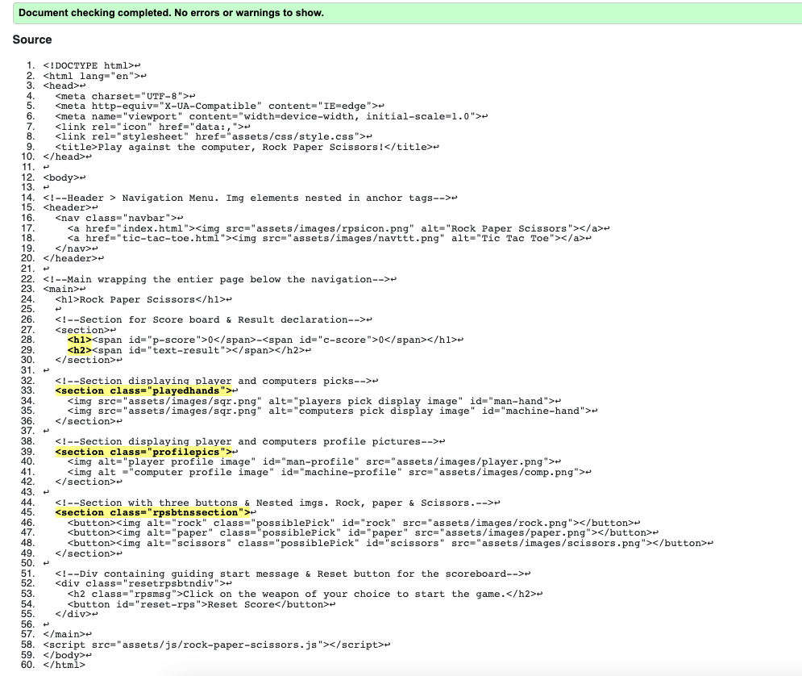
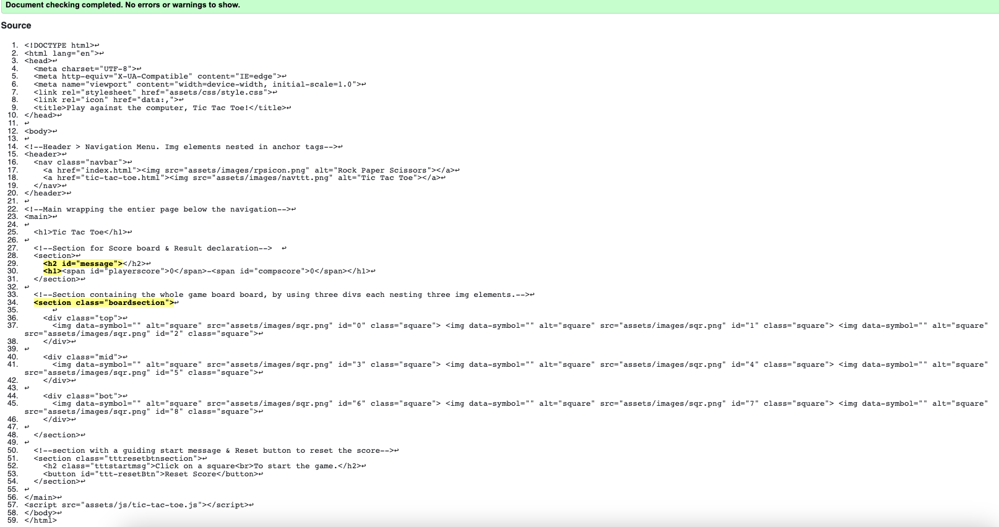
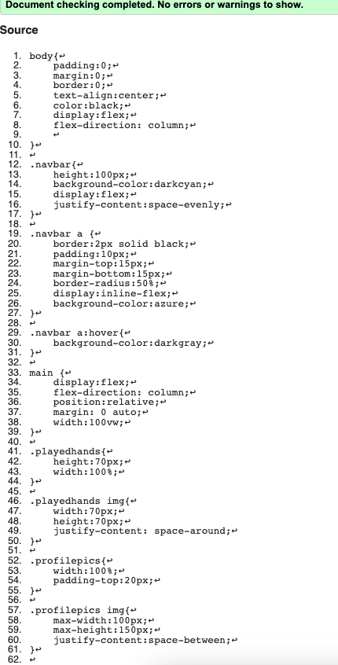
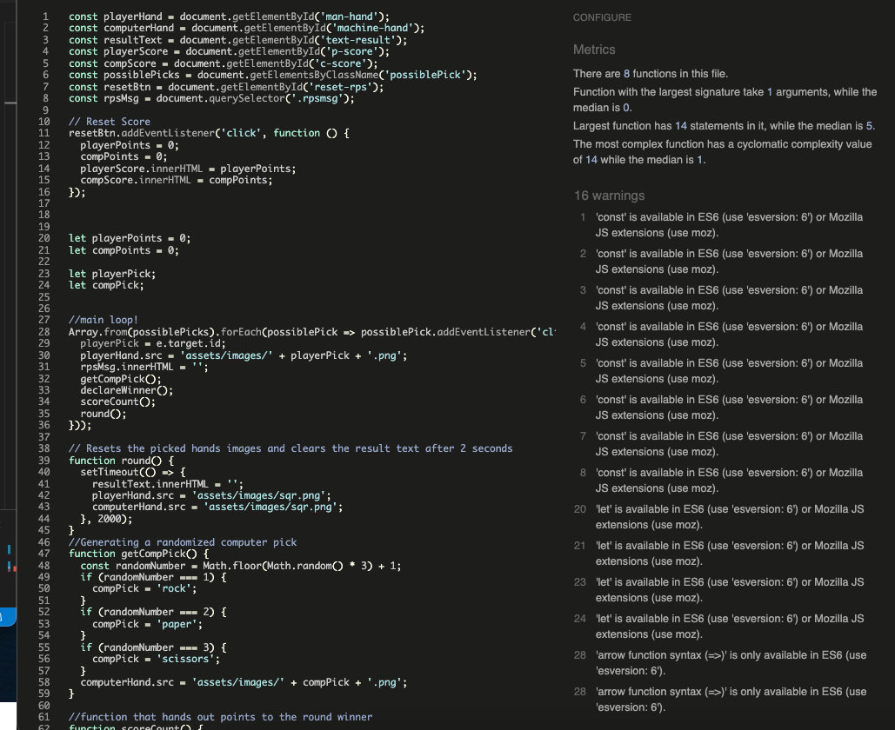
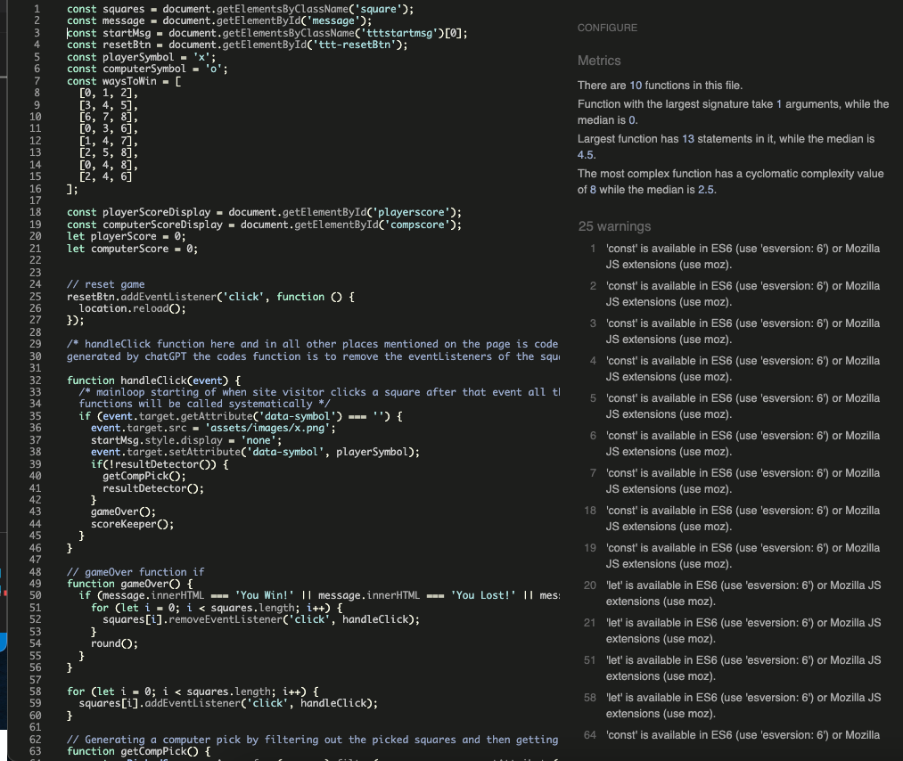
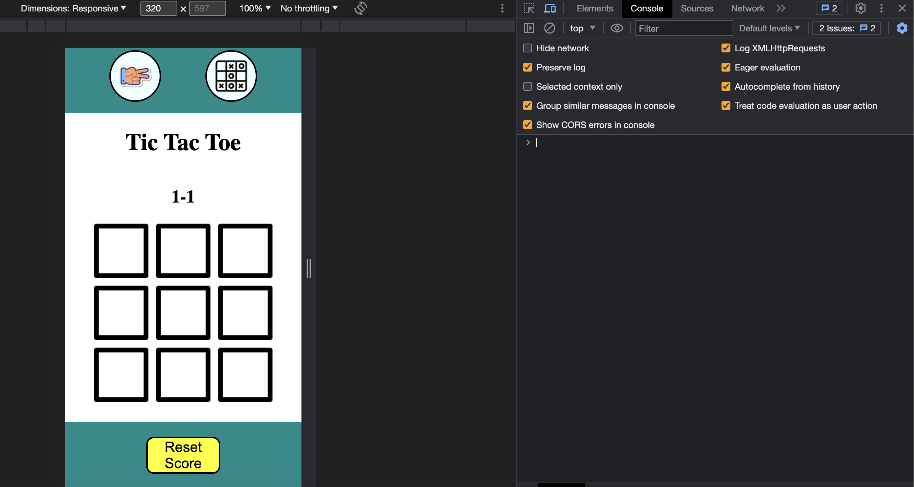

# ManvsMachine.
Play rock paper scissors & Tic tac toe against the computer.

[Link to the live project](https://mejkej.github.io/P2MANvsMACHINE/index.html)

## Introduction:
This was my second project using HTML & CSS and the first one using Javascript. 
So the project contains two games, rock paper scissors & Tic tac toe.
HTML and CSS for structure and styling and Javascript for functionality.

## Purpose:
Purpose, well the primary goal or purpose of this project was for me to learn Javascript.
And i did succesfully create two games that would probably have been considered less than mediocre in 1985 hehe.
But Rome was not built in a day and neither is a great programmer! 
## The Rock paper scissors game HTML & CSS part:
### Header Navbar
Header > Nav > Anchor. The two existing anchor elements wraps an img each. Headers background color set to darkcyan. The width is 100vw & The height is 100px. The a/img elements are styled to be round and has a 2 px solid black border.
Also hover effect turning the white background color darker/gray when hovered.
First time i used css flex and it was very practical.

### Main (Wrapping everything below the header)
#### H1 text "Rock Paper Scissors"

#### First Section Scoreboard & Result declaration
H1 with two spans that by default displays 0-0.
H2 with a nested span that declares the outcome of the game.

#### Second Section (Pick display)
Contains two img elements. Displaying a default blank image or the player and the computers picks.

#### Thrid Section (Profile Pictures)
Contains two img elements. The player and the computers "profile pictures".
#### Fourth Section
Sections background color is set to darkcyan and the width is set to 100 vw.
Contains three buttons:
Rock, paper and scissors. Img element nested inside the buttons. The buttons are styled with a black solid border of 2 px, They are slightly rounded with a border radius of 10 px and has a hover effect changing the white background color to darkred. 
#### Div container 
Contains a  H2 that acts as a guiding start message. Below it is a button that resets the score. This button has a yellow background color, and are wider than the buttons above. The rest of the styling is the same as the buttons above.

## The Rock, paper, scissors Javascript:
First off i declared all the global scope variables and linked them to their HTML elements.

### Reset score button
I added a event listener to the reset button if clicked the let variables 
'playerPoints' & 'compPoints' will be set to 0.
and the Const playerScore & const compScore.innerHTML displayes the let variables value.

### The main loop

starts of with an Array from the const variable PossiblePicks. Array containing rock, paper & scisssors ofc.
using a forEach loop and an arrow function possiblePicks turns in to possiblePick that has an eventlistener listening 
for a click. the let variable playerPick gets assigned the e.targets.(ID) the id could be rock paper or scissors.
playerHand.src gets assigned 'assets/images/' + playerPick + '.png'. (The path to the clicked image).
rpsMsg.innerHTML = ''; (Setting the string of the guiding start message to be empty)
The loop then continues with:
getCompPick();
declareWinner();
scoreCount();
round();

### GetCompPick
inside this function a const variable is declared called randomNumber. randomNumber = a method 
"Math.floor(Math.random() * 3) + 1;
Math.floor Makes the random number generated to a 0 - 1 or 2 and not 0,33 0,66 or 0,99.
The +1 makes the possible numbers generated 1, 2, or 3 instead of 0, 1, or 2.
Then there is 3 if statements pairing the random numbers to either rock paper or scissors.
If randomNumber === 1 compPick = rock and computerHand.src = 'assets/images/' + CompPick + '.png'.

### declareWinner
In this function all the possible outcomes of a round is stated and how they should be handled.
So the picks gets compared and then the resultText.innerHtml Declares Win Loss or Draw.

### scoreCount
This function handles the scoreboard by looking at the resultText.innerHtml messsage.
If the result text declares 'YOU WIN!' the let variable playerPoints increases by 1.
And that then results in that the const variable playerScore.innerHTML displays the value of
playerPoints and viceversa if the computer wins.
 
### round
This function resets the SRC of the playerHand image & compHand image. It also clears the resultText.
So that after both players have made their Picks the result has been declared and the scoreboard has been
updated. Both played hand images and result text is cleared indicating that its time to play the next round
while still keeping track of the Scoreboard.

## The Tic Tac Toe games HTML & CSS:

### Header Navbar 
Its exacly the same as on the other page.

### Main (Wrapping everything below the header)
#### H1 text "Tic Tac Toe"

#### Section for Scoreboard & Result declaration.
H2 declaring the games outcome. 
H1 with two nested spans default displaying 0-0.

#### Section two, The gameboard.
Contains three divs, top, mid and bot. Each div contains three img elements each img element is a square on the board. The img displays an unpicked square by default, but if picked the src and data-symbol will change depending on who picked the square.

#### Third Section, Guide message & Reset Score Btn
Sections background color is set to match the Header and contains: H2 element acting as a guiding start message & Button with the text "Reset Score".

## The Tic tac toe games Javascript:
### Declared variables
First of i declared most of the variable at the top. Some of them i linked to the HTML and others was assigned a value.

### resetBtn
Added a event listener to the button if button is clicked the page will get reloaded.
Im sure there are better ways of doing that but time was of the essence and it does the job.

### for loop
squares is a const varible, the object is gotten using a class selector.
The for loop adds a click event listener to the squares[i]. Then it refers to the handleClick function,
resulting in that everytime a square is clicked the handleClick function is called to handle the event.

### The Main loop handleClick(event)
The function first checks if clicked square has a data-symbol, if not that means the square has not yet been picked.
The square / event target gets asigned the src of 'assets/images/x.png' Then the startMsg is hidden, and a data-symbol attribute of 'x' / playerSymbol. The loop then goes on to check if there is a win, lose or draw. if there is not the getCompPick() function is called. The result detector function checks for a outcome in between each time the player and the computer makes a move.
If an outcome of the game is detected the gameOver() function is called which calls for the round() function. Followed by the scoreKeeper() function.

### resultDetector()
Checks the squares data-symbols to see if there are any winning combinations on the board. If true, the varible winner which is set to null by default will be set to the winners data-symbol.
If there is a winner the message variable will state either 'You Win!' or 'You Lost!'. If there is not a winner the function checks for a draw. By an array checking if there is any squares without a data-symbol set. If there is not it will return true and the message will display 'Draw!'. If none of these scenarios are true the handleClick loop will continue let the player and the computer make their moves until a result is detected.  
### getCompPick()
Through an array of all squares filtering out the squares with a set data-symbol. This function will generate a randomized computer pick by generating a random number depending on the amount of squares available. The UnpickedSquare[randomNumber] will get the src and data-symbol representing the computer.

### gameOver()
This function removes the event listener from the squares for loop. If the message.innerHTML declares an outcome. It then goes on to call for the round() function.

### round()
This function resets the squares src and data-symbol attribute to the default, it also re-attaches the squares event listener and resets the message to an empty string during a two second time out.

### scoreKeeper()
This function updates the score if a winner is declared the let variable computerScore or playerScore will ++. The const variables computerScoreDisplay & playerScoreDisplays innerHTML will display the Score until score is reset (By clicking the reset score button) or the webpage is refreshed.

## Testing & Validation
### HTML & CSS validated by[validator.w3.org](https://validator.w3.org/#validate_by_input):
#### Rock, paper scissors HTML validated without errors.

#### Tic tac toe HTML validated without errors.

#### CSS validated without errors.

### Javascript Validated by[Jshint validator](https://jshint.com/):
#### RPS Javascript validated without errors.

#### TTT Javascript validated without errors.

### Javascript manual testing with developer tools

## My personal thaught on the project
The jump from Html & Css to Javascript was surprisingly challenging i gotta say. But for everyday that i worked on the project it made more and more sense. I think i almost finished the rock paper scissors game 10 times just to clear the whole JS file and redo the whole thing over and over again until it made sense. If you know html css and javascript you can get a job, atleast thats what a few dudes on youtube claims. So i did my best to try and learn as much as possible.
But the clock is ticking and i gotta get started on the next project! All in all it was a great experience and project.
I am certainly looking forward to the day that i will be working on something more exciting!

# Re-submission

### Issues pointed out and fixed 

#### HTML
1. Lack of semantic html elements.
Fix: added Header, Nav, Main and sections to both HTML files.

2. Broken images caused by missing alt & Src attributes (Failed HTML Validation)
Fix: set a default Src & Alt.

2. Webpage titles
Fix: Changed the titles to be more descriptive.

#### Tic Tac Toe javascript
1. Issues with scoreboard not updating correctly in certain scenarios.
2. Issues with the the gameboard not getting reset in certain scenarios.
3. Console errors
Fix: Updated the code so that, everything is functioning correctly now. Re structured the code so that only incase of a result it will go down the gameOver round scoreKeeper path. Which now also removes event listeners from the squares while reseting the game.

#### README file
1. Missing cloning instructions.
2. Missing deployment instructions.

#### Lack of git commit messages
Fix: I have tried my best to keep consistant in pushing short descriptive commits.

#### Other feedback
1. Lack of clear visual feedback to users.
Fix: Added a guiding start message to both games that gets hidden after player has initialized the game.

2. Improved testing.
Fix: Manually tested the games by playing the games while watching developer tools & Reading through the assesors feedback.

## Resources:
The resources i have used to get this project done:

Sources off icons and images: [Icons8.com](https://icons8.com)

[Amiresponsive](https://ui.dev/amiresponsive)
Images diplaying the project using different devices.

[Open Ais chat GPT](https://chat.openai.com/chat)
This has been a complety incredible tool that i have used. NOT TO WRITE THE CODE FOR ME.
But more like a teacher. All doe i have credited some of the code to Chat GPT.
It has also been useful during the resubmisson of this project.

[Youtube.com](https://www.youtube.com/) 

[W3Schools.com](https://www.w3schools.com/)

[CodeInstitute.net](https://codeinstitute.net/global/)

[CodeInstitutes ReadMe template Love-maths](https://github.com/Code-Institute-Solutions/readme-love-maths/tree/master)

Developer tools has also been a great resource.

## Deployment
The site was deployed to GitHub pages. The steps to deploy are as follows:
In the GitHub repository, navigate to the Settings tab
From the source section drop-down menu, select the Main Branch.
Once the main branch has been selected, the page will be automatically refreshed with a detailed ribbon display to indicate the successful deployment.

## Clone the project
Incase anyone want to contribute to the project or develop it further here is a step by step guide to clone it:
1. Go to https://github.com/mejkej/P2MANvsMACHINE 
2. Press the button with the text "Code" and an arrow down.
3. You will be presented with the available options of how to clone it.

[here are instructions on how to clone it](https://docs.github.com/en/repositories/creating-and-managing-repositories/cloning-a-repository#cloning-a-repository)
